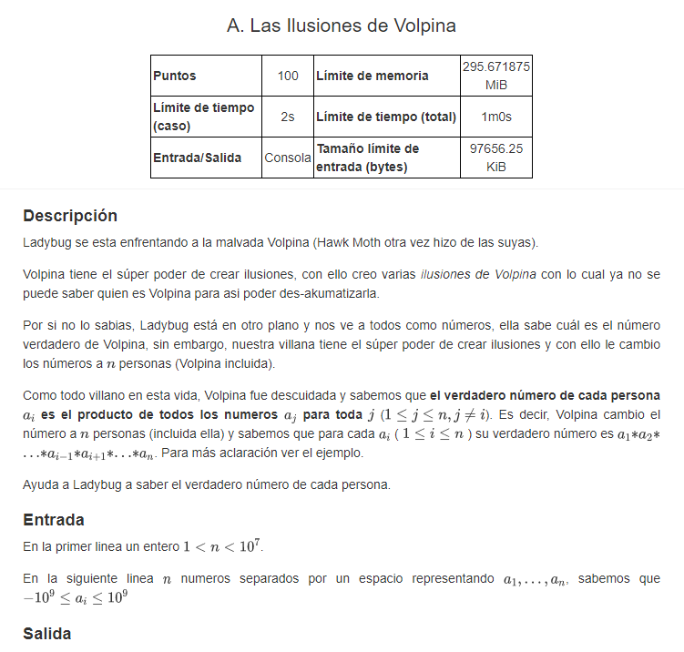
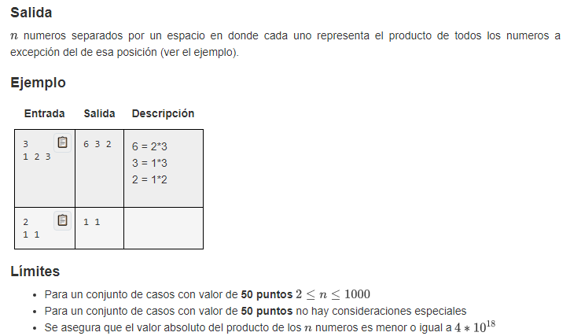
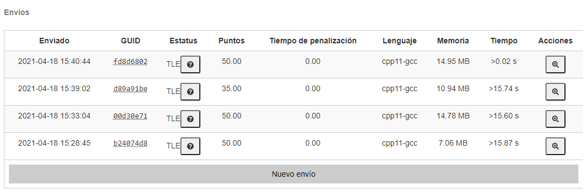
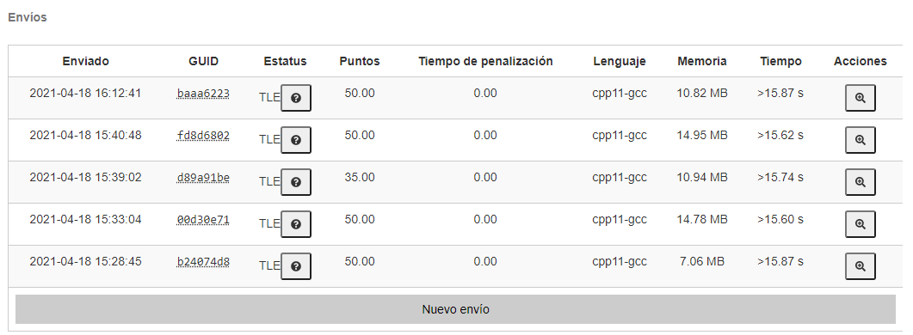

# EX1_A: Las ilusiones de Volpina

## EXPLICACIÓN

## NO LOGRÉ CONSEGUIR LOS 100 PUNTOS

> Solo logré conseguir 50 / 100 puntos. Mi problema fue que en cada caso obtuve
> un Time Limit Exceeded (TLE). Intenté solucionarlo de diversas maneras, pero
> con ninguna logré bajar el tiempo para obtener todos los puntos.

## MI MEJOR SOLUCIÓN

> La que yo creo que fue mi mejor solución fue la que está en la carpeta de
> [SOLUCION_sin_TLE](SOLUCION_sin_TLE/ "Carpeta con mi mejor solución"), pero
> aunque la carpeta se llame así no lo logré.
>
> Específicamente, la que creo que fue mi mejor solución es:
> > [Mi mejor solución del \[EX1 - EJERCICIO A\]](SOLUCION_sin_TLE/omegaUp.cpp)

## ¿CÓMO PODRÍA ARREGLARLO?

> Para una mejor implementación creo que tendría que dejar de hacer el for en
> el cual hago las operaciones dentro del otro for. Tendría que hacer un proceso
> fuera de otro for para que el tiempo fuera O(n) y no O(n^2), pero no logré
> saber cómo lograrlo. Por ahora así lo dejaré.

## CAPTURAS CON MIS ENVÍOS

